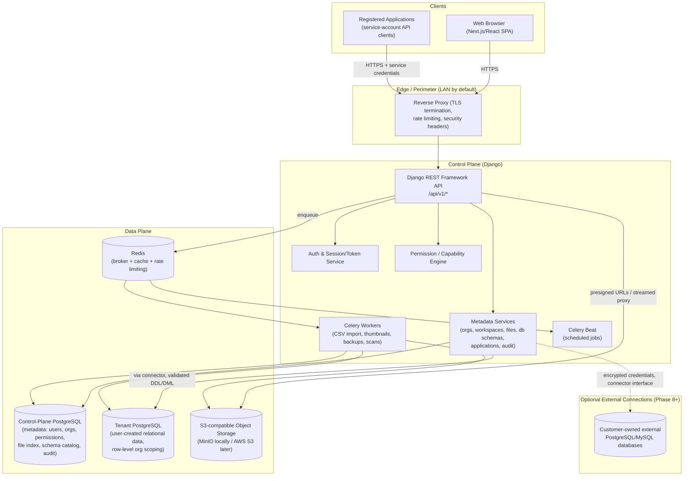
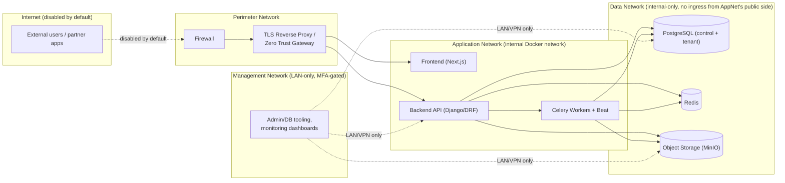
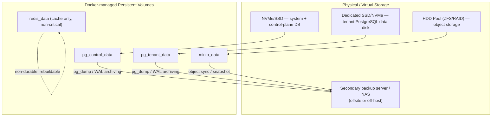
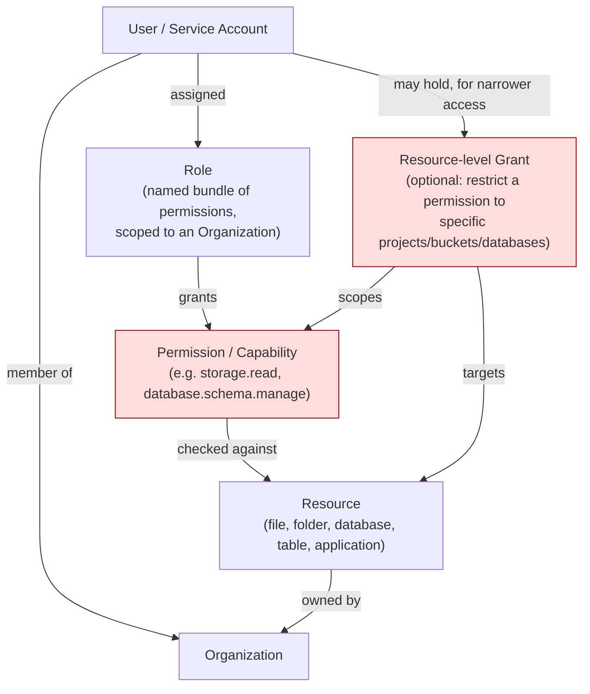

# Architecture Overview — Private Data Cloud

Status: DRAFT (Phase 0)
Last updated: 2026-08-07

## 1. Purpose

Private Data Cloud (PDC) is a self-hosted platform combining file storage
(Drive/S3-like), a no-code relational database builder (Airtable/Supabase-like),
and an application-integration layer, aimed at organizations that want to run
their own infrastructure instead of depending on AWS/Azure/GCP.

This document describes the system as a whole: its major components, how they
communicate, and the principles that constrain future design decisions. It is
intentionally conservative — the goal is a system that can be trusted with
real organizational data, not one that maximizes feature velocity.

## 2. Guiding Principles

1. **Local-first.** The platform must run fully on private infrastructure
   with no outbound internet dependency for normal operation, after images
   and packages are installed.
2. **Control plane / data plane separation.** Django never *is* the data —
   it describes, authorizes, and audits access to data that lives in
   PostgreSQL (relational) and S3-compatible object storage (blobs).
3. **Deny by default.** Every resource access requires an explicit,
   server-side authorization check. The UI is never the authorization
   boundary.
4. **Tenant isolation is a backend invariant**, not a UI convenience.
   Organization A must never be able to reach Organization B's data by
   manipulating identifiers, regardless of what the frontend renders.
5. **No unreviewed dynamic SQL.** Anything that creates schemas/tables from
   user input goes through a validated, whitelisted, transactional service
   layer — never string-concatenated SQL.
6. **Boring technology first.** Docker Compose before Kubernetes, Django
   session/token auth before a full OIDC provider, synchronous code before
   async where load doesn't demand it. Complexity is added when a concrete
   requirement forces it, not speculatively.
7. **Incremental delivery.** The system is built and validated phase by
   phase (see [ROADMAP.md](ROADMAP.md)); later phases must not force a
   redesign of earlier ones.

## 3. High-Level System Architecture

Key point: the browser and registered applications **never** talk to
PostgreSQL, Redis, or object storage directly. Everything is mediated by the
Django API, which enforces authorization and produces audit records.

## 4. Network Architecture

Rules:

- Only the reverse proxy is reachable from outside the host/LAN edge.
- PostgreSQL, Redis, object storage admin console, and the Docker socket are
  bound to the internal Docker network only — never published to the host's
  public interface.
- Management/monitoring tooling sits on a separate network segment reachable
  only from the LAN or an administrative VPN, with MFA for admin accounts.
- Internet exposure (Phase 10) inserts a Zero Trust gateway / TLS proxy in
  front of the same application network; it does not change the internal
  topology.

## 5. Storage Architecture

Notes:

- RAID/ZFS provides redundancy against disk failure, not protection against
  accidental deletion, corruption, or ransomware — backups are a distinct,
  independently tested process (see
  [BACKUP_RESTORE.md](../operations/BACKUP_RESTORE.md)).
- Redis holds only rebuildable state (broker queue, cache, rate-limit
  counters) and is not part of the durability guarantee.
- Object storage uses content-addressed or UUID-based keys generated
  server-side; the physical filesystem path is never exposed to clients.

## 6. Authorization Model (Overview)

Every authorization decision is: *"Does this actor have this permission,
either organization-wide via a Role or specifically via a Resource Grant, on
a resource owned by an Organization the actor belongs to?"* This is
evaluated server-side, in a single shared service (see
[PERMISSIONS.md](../security/PERMISSIONS.md)), never duplicated ad hoc in
individual views.

## 7. Component Responsibilities

| Component | Responsibility | Must NOT do |
|---|---|---|
| Next.js/React frontend | Presentation, UX, optimistic UI, client-side validation for UX only | Be trusted for authorization; hold long-lived secrets |
| Django/DRF API | Authn, authz, validation, orchestration, audit, presigned URL issuance | Store large blobs in DB rows; act as a filesystem proxy for arbitrary paths |
| Celery workers | CSV import, async jobs, backups, malware-scan hooks, thumbnailing | Perform unaudited privileged operations |
| Control-plane PostgreSQL | Users, orgs, permissions, file index, schema catalog, jobs, audit | Store tenant business data rows |
| Tenant PostgreSQL | User-created database schemas/tables/rows | Be reachable directly by browsers or external apps |
| Object storage (S3-compatible) | Durable blob storage for uploaded files | Be reachable directly by browsers without a presigned URL |
| Redis | Celery broker, cache, rate limiting | Be a system of record for anything durable |
| Reverse proxy | TLS termination, routing, basic rate limiting, security headers | Perform business authorization |

## 8. Data Plane: One Tenant Postgres, Row-Scoped — Rationale

See [ADR-0005](adr/0005-tenant-database-isolation-strategy.md) for the full
analysis. Summary: user-created databases/tables live inside one or more
dedicated "tenant" PostgreSQL clusters, isolated from each **other**
organization at the schema level (`org_<uuid>` schema per organization),
while the control plane enforces which organization/user may touch which
schema. This avoids both the operational cost of "one Postgres instance per
tenant" and the weak isolation of "one shared schema keyed by `org_id`
column alone."

## 9. Cross-Cutting Concerns

- **Audit logging**: every mutating control-plane operation and every schema
  change emits an audit event before the transaction commits successfully
  (see [Section 18 of the master prompt] and audit module design in
  DATA_MODEL.md).
- **Idempotency / request IDs**: every API request is tagged with a request
  ID, propagated to logs, audit records, and error responses.
- **Observability**: structured JSON logs, `/healthz` (liveness),
  `/readyz` (dependency checks: DB, Redis, object storage), Celery queue
  depth metrics — see ROADMAP Phase 11.
- **Configuration**: all environment-specific values via environment
  variables (`.env`, never committed); see `.env.example`.

## 10. What This Document Deliberately Does Not Cover

- Exact Django app boundaries and models → [DATA_MODEL.md](DATA_MODEL.md)
- Threats and mitigations → [THREAT_MODEL.md](../security/THREAT_MODEL.md)
- Concrete role/permission list → [PERMISSIONS.md](../security/PERMISSIONS.md)
- How to actually stand this up locally → [LOCAL_DEPLOYMENT.md](../deployment/LOCAL_DEPLOYMENT.md)
- Phase sequencing → [ROADMAP.md](ROADMAP.md)
