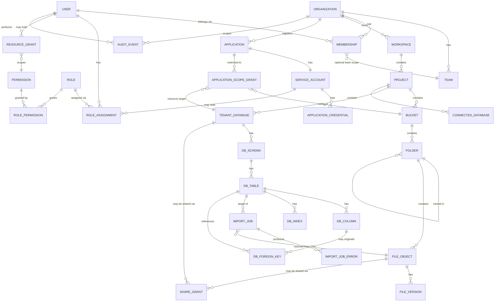

# Data Model — Private Data Cloud

Status: DRAFT (Phase 0)
Last updated: 2026-08-07

This document defines the control-plane entity model (Django apps/models) and
the tenant data-plane conventions. It is the reference for Phase 2+
implementation; exact field lists will be refined into migrations, but the
entities, relationships, and ownership rules defined here should not change
without an ADR update.

## 1. Django Module Boundaries

Each bounded module owns its own models, services, serializers, and tests.
Cross-module access goes through service functions/interfaces, not direct
ORM reach-through, so modules stay independently testable.

| Module | Owns |
|---|---|
| `accounts` | User, credentials, sessions, MFA |
| `organizations` | Organization, Team, Membership |
| `permissions` | Permission, Role, RoleAssignment, ResourceGrant |
| `workspaces` | Workspace, Project |
| `storage` | Bucket, Folder, FileObject, FileVersion |
| `databases` | TenantDatabase, Schema, Table, Column, ForeignKey, Index, ConnectedDatabase |
| `datasets` | (higher-level dataset abstraction over one or more tables, used by import/export) |
| `imports` | ImportJob, ImportJobError, ColumnMapping |
| `applications` | Application, ServiceAccount, ApplicationCredential, Scope |
| `sharing` | ShareGrant (resource + principal + level + expiry) |
| `audit` | AuditEvent |
| `system` | Quota, BackupRecord, HealthCheckResult, Configuration |

## 2. Core Entity Relationship Diagram (Control Plane)

## 3. Entity Notes

### 3.1 Identity & Tenancy

- `User`: authentication identity. Never stores plaintext passwords (Django's
  hashed password field); MFA fields added in Phase 2/11.
- `Organization`: top of the tenancy tree. **Every** tenant-owned model below
  carries a direct or indirect `organization_id` foreign key — never
  inferred solely from a parent chain in application code without a
  database-level constraint/check where feasible.
- `Team`: optional grouping inside an Organization for coarse-grained
  membership scoping (e.g. "Data Engineering").
- `Membership`: join of `User` × `Organization` (+ optional `Team`), carries
  status (active/invited/suspended).

### 3.2 Permissions

- `Permission`: a static, code-defined capability string (e.g.
  `storage.read`). Seeded via migration/fixture, not user-editable.
- `Role`: named bundle of Permissions, scoped to an Organization (orgs may
  define custom roles later; ships with system default roles that cannot be
  deleted).
- `RoleAssignment`: `User` (or `ServiceAccount`) × `Role` × `Organization`
  (+ optional `Team`/`Project` scope narrowing).
- `ResourceGrant`: fine-grained exception/addition — grants a single
  Permission on a single Resource (e.g. one bucket, one TenantDatabase) to a
  User/ServiceAccount, with optional expiry. Used for sharing and for
  Application scope restriction.

### 3.3 Workspaces

- `Workspace`: organizational grouping above Project (e.g. "Marketing").
- `Project`: the unit that actually owns storage buckets and databases. Most
  UI navigation and most permission checks resolve at Project granularity.

### 3.4 Storage

- `Bucket`: logical container within a Project. Object keys use a
  server-generated prefix (`<org-uuid>/<project-uuid>/<bucket-uuid>/<file-uuid>/<content-uuid>`)
  against one shared physical S3/MinIO bucket (`OBJECT_STORAGE_BUCKET_PREFIX`)
  rather than one physical bucket per logical `Bucket` — simpler to operate
  (no MinIO bucket-naming/proliferation concerns) while still giving every
  file a unique, unguessable, server-generated key. Never a literal
  user-supplied path.
- `Folder`: virtual hierarchy stored as metadata rows — implemented as an
  adjacency list (`parent` self-FK), not a real filesystem directory.
- `FileObject`: one logical file. Stores UUID, bucket/folder FK, object
  key, original filename (untrusted, display-only), sanitized display name,
  detected MIME type (server-verified, not trusted from browser), size,
  checksum (sha256), status (`active`/`deleted`/`quarantined`), creator,
  timestamps.
- `FileVersion`: append-only version history for a `FileObject` when
  versioning is enabled for a bucket.

### 3.5 Databases (Tenant Data Plane Metadata)

- `TenantDatabase`: control-plane record describing a logical database the
  platform manages for a Project. Points at which physical Postgres cluster
  + schema name (`org_<uuid>__db_<uuid>`) actually stores the data (see
  ADR-0005).
- `DBSchema` / `DBTable` / `DBColumn` / `DBIndex` / `DBForeignKey`: the
  control plane's **catalog** mirroring what was actually created in the
  tenant Postgres schema. The catalog is written inside the same transaction
  as the real DDL, by the schema service — never independently, to avoid
  drift.
- `ConnectedDatabase`: metadata + encrypted credentials for an
  externally-hosted database in **connected mode** (query pass-through,
  nothing copied). Distinct model from `TenantDatabase` on purpose — see
  Section 15 of the master prompt and ADR-0009.

### 3.6 Imports

- `ImportJob`: one CSV import attempt — source `FileObject`, target
  `DBTable`, column mapping, inferred vs confirmed types, status, row
  counts (total/succeeded/rejected), timestamps.
- `ImportJobError`: per-row or per-batch error detail, capped and
  paginated — not an unbounded blob.
- `ColumnMapping`: CSV column → target `DBColumn` (or "create new column"),
  plus the user-confirmed type.

### 3.7 Applications

- `Application`: registered piece of software, owned by an Organization,
  with an owning `User`.
- `ServiceAccount`: the identity an `Application` authenticates as; can hold
  `RoleAssignment`s and `ResourceGrant`s exactly like a `User`, but cannot
  log into the web UI.
- `ApplicationCredential`: stores a hash (not the plaintext secret) plus
  metadata (created_at, last_used_at, expires_at, revoked_at). Plaintext
  secret is returned exactly once, at creation/rotation time, in the API
  response only.
- `ApplicationScopeGrant`: restricts a Scope (e.g. `database:read`) to
  specific resources — enforced as `ResourceGrant`s under the hood.

### 3.8 Sharing

- `ShareGrant`: principal (`User`/`Team`/`Organization`/role) × resource ×
  level (`read`/`write`/`admin`) × optional expiry. Internal-only in Phase 9;
  external sharing (expiring links, passwords, IP restriction) is a later
  addition to the same table via nullable columns, not a parallel model.

### 3.9 Audit

- `AuditEvent`: append-mostly (no update, restricted delete) log:
  timestamp, actor (`User`/`ServiceAccount`/`system`), organization, action,
  resource_type, resource_id, request_id, source context (IP/user-agent
  where appropriate), result (`success`/`denied`/`error`). No secrets or
  full personal data payloads.

### 3.10 System

- `Quota`: per-Organization/Project storage and database usage limits +
  current usage counters (updated by workers, not computed live on every
  request).
- `BackupRecord`: metadata about completed backups (what, when, where,
  verified-restorable flag) — the artifacts themselves live in the backup
  storage target, not the DB.
- `HealthCheckResult` / metrics: short-lived operational data, may live in
  Valkey/metrics store rather than Postgres.

## 4. Tenant-Isolation Invariant (applies to every table above marked
   tenant-owned)

Every tenant-owned row is reachable, in the ORM, only through a queryset
that has been explicitly filtered by the requesting actor's authorized
Organization(s). This filtering happens in one shared base
manager/service layer (Phase 2 deliverable), not re-implemented per view.
Tests in `tests/security/test_tenant_isolation.py` (Phase 2+) must prove
Organization A cannot read/write Organization B's rows via ID
substitution (IDOR/BOLA).

## 5. Migration Strategy

- Control-plane schema evolves via standard Django migrations.
- Tenant schema DDL (user-created tables) is generated by the `databases`
  service layer at runtime, not via Django migrations — it is
  data-driven, not code-driven. Django migrations only manage the
  **catalog** tables that describe tenant schemas, never the tenant schemas
  themselves.
