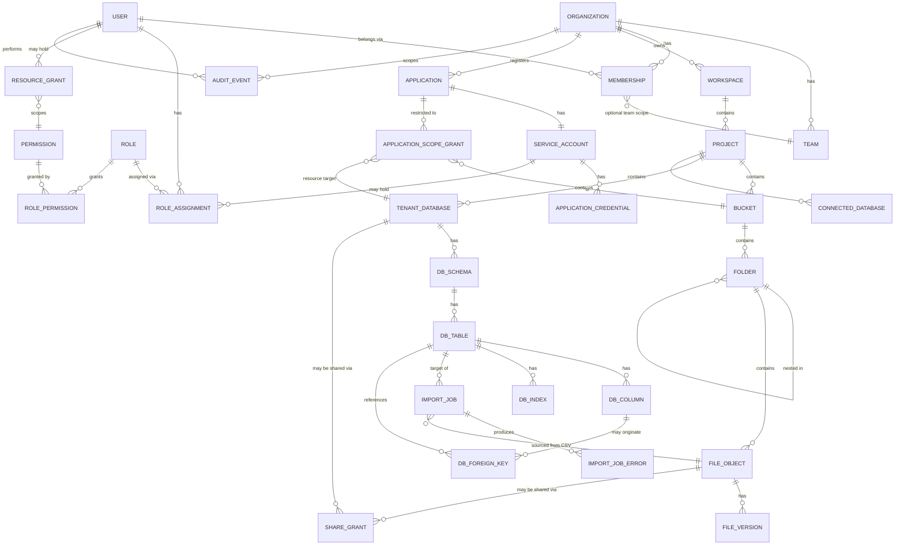

# Data Model — Private Data Cloud

Status: Living document — implemented through Phase 12 (production
hardening); no longer a Phase 0 draft. Updated alongside the code as new
phases land, per CLAUDE.md's engineering process.
Last updated: 2026-08-19

This document defines the control-plane entity model (Django apps/models) and
the tenant data-plane conventions. It is the reference for Phase 2+
implementation; exact field lists will be refined into migrations, but the
entities, relationships, and ownership rules defined here should not change
without an ADR update.

## 1. Django Module Boundaries

Each bounded module owns its own models, services, serializers, and tests.
Cross-module access goes through service functions/interfaces, not direct
ORM reach-through, so modules stay independently testable.

| Module | Owns |
|---|---|
| `accounts` | User, credentials, sessions, MFA |
| `organizations` | Organization, Team, Membership |
| `permissions` | Permission, Role, RoleAssignment, ResourceGrant |
| `workspaces` | Workspace, Project |
| `storage` | Bucket, Folder, FileObject, FileVersion |
| `databases` | TenantDatabase, Schema, Table, Column, ForeignKey, Index, ConnectedDatabase |
| `datasets` | (higher-level dataset abstraction over one or more tables, used by import/export) |
| `imports` | ImportJob, ImportJobError, ColumnMapping |
| `applications` | Application, ServiceAccount, ApplicationCredential, Scope |
| `sharing` | ShareGrant (resource + principal + level + expiry) |
| `audit` | AuditEvent |
| `system` | Quota, BackupRecord, HealthCheckResult, Configuration |

## 2. Core Entity Relationship Diagram (Control Plane)

## 3. Entity Notes

### 3.1 Identity & Tenancy

- `User`: authentication identity. Never stores plaintext passwords (Django's
  hashed password field). MFA fields (`mfa_enabled`, `mfa_secret_encrypted`
  — Fernet, `accounts/crypto.py` — `mfa_confirmed_at`) — implemented
  Phase 10, RFC 6238 TOTP (`accounts/totp.py`).
- `Organization`: top of the tenancy tree. **Every** tenant-owned model below
  carries a direct or indirect `organization_id` foreign key — never
  inferred solely from a parent chain in application code without a
  database-level constraint/check where feasible.
- `Team`: optional grouping inside an Organization for coarse-grained
  membership scoping (e.g. "Data Engineering").
- `Membership`: join of `User` × `Organization` (+ optional `Team`), carries
  status (active/invited/suspended).

### 3.2 Permissions

- `Permission`: a static, code-defined capability string (e.g.
  `storage.read`). Seeded via migration/fixture, not user-editable.
- `Role`: named bundle of Permissions, scoped to an Organization (orgs may
  define custom roles later; ships with system default roles that cannot be
  deleted).
- `RoleAssignment`: `User` (or `ServiceAccount`) × `Role` × `Organization`
  (+ optional `Team`/`Project` scope narrowing).
- `ResourceGrant`: fine-grained exception/addition — grants a single
  Permission on a single Resource (e.g. one bucket, one TenantDatabase) to a
  User/ServiceAccount, with optional expiry. Used for sharing and for
  Application scope restriction.

### 3.3 Workspaces

- `Workspace`: organizational grouping above Project (e.g. "Marketing").
- `Project`: the unit that actually owns storage buckets and databases. Most
  UI navigation and most permission checks resolve at Project granularity.

### 3.4 Storage

- `Bucket`: logical container within a Project. Object keys use a
  server-generated prefix (`<org-uuid>/<project-uuid>/<bucket-uuid>/<file-uuid>/<content-uuid>`)
  against one shared physical S3/MinIO bucket (`OBJECT_STORAGE_BUCKET_PREFIX`)
  rather than one physical bucket per logical `Bucket` — simpler to operate
  (no MinIO bucket-naming/proliferation concerns) while still giving every
  file a unique, unguessable, server-generated key. Never a literal
  user-supplied path.
- `Folder`: virtual hierarchy stored as metadata rows — implemented as an
  adjacency list (`parent` self-FK), not a real filesystem directory.
- `FileObject`: one logical file. Stores UUID, bucket/folder FK, object
  key, original filename (untrusted, display-only), sanitized display name,
  detected MIME type (server-verified, not trusted from browser), size,
  checksum (sha256), status (`active`/`deleted`/`quarantined`), creator,
  timestamps.
- `FileVersion`: append-only version history for a `FileObject` when
  versioning is enabled for a bucket.

### 3.5 Databases (Tenant Data Plane Metadata) — implemented Phase 4

- `TenantDatabase`: control-plane record describing a logical database the
  platform manages for a Project. `schema_name` is a server-generated
  Postgres schema name — implemented as `db_<tenant-database-uuid-hex>`
  (e.g. `db_3f9a...`, 35 characters), not the
  `org_<uuid>__db_<uuid>` pattern ADR-0005 originally sketched: that
  pattern is 73 characters, over Postgres's 63-byte identifier limit.
  Uniqueness only needs the `TenantDatabase`'s own UUID — the
  organization is already recoverable via
  `project.workspace.organization` and doesn't need to be embedded in the
  physical name too.
- No separate `DBSchema` model. ADR-0005 settled on one physical Postgres
  schema per `TenantDatabase` (not one schema per organization with
  sub-namespacing), so a `DBSchema` catalog row would duplicate exactly
  what `TenantDatabase` already records (its own `schema_name`) — cut as
  redundant rather than implemented as a pass-through wrapper.
- `DBTable` / `DBColumn` / `DBForeignKey` / `DBIndex`: the control plane's
  **catalog** mirroring what was actually created in the tenant Postgres
  schema. Catalog writes happen immediately after the real DDL succeeds,
  each in their own `default`-connection transaction — not literally the
  *same* transaction as the DDL, since `default` and `tenant` are
  different physical connections with no distributed-transaction support
  between them (ADR-0001). A failed catalog write after successful DDL
  triggers a best-effort compensating `DROP`; see
  `apps/backend/databases/services.py` and the Phase 4 note in
  [ROADMAP.md](ROADMAP.md) for the honest limits of that guarantee.
- `DBIndex` is currently created only automatically, alongside a unique
  column — there is no user-facing "create an arbitrary index" endpoint
  yet. It still mirrors something real: Postgres's implicit index backing
  the `UNIQUE` constraint on that column.
- `ConnectedDatabase` — implemented Phase 8: metadata + Fernet-encrypted
  credentials (`databases/crypto.py`) for an externally-hosted database
  in **connected mode** (query pass-through, nothing copied). Distinct
  model from `TenantDatabase` on purpose — see Section 15 of the master
  prompt and ADR-0009. `engine` is currently `postgresql` only
  (`databases/connectors.py`'s `Connector` protocol is engine-agnostic;
  MySQL/MariaDB/SQL Server/SQLite are future work behind the same
  interface). Read-only: schema introspection and paginated row
  browsing, both re-verified against the *live* external schema on every
  call rather than a cache. Write pass-through is explicitly out of
  scope for this phase (ADR-0009 Final Recommendation).

**Data Explorer (Phase 6):** no new models — row browsing/editing
(`databases/rows.py`, `databases/values.py`) is pure query/mutation logic
against the real tenant table, reusing the `DBTable`/`DBColumn` catalog
that already exists. There was never a separate "row" catalog entity to
add; the whole point of the catalog is that it's the only source of truth
needed to safely construct row-level SQL at runtime.

### 3.6 Imports — implemented Phase 5

- `ImportJob`: one CSV import attempt — source `FileObject`, target
  `DBTable`, confirmed `encoding`/`delimiter` (captured once at preview
  time, never re-sniffed mid-stream — a streamed S3 body can't be
  rewound), `column_mapping` (JSON, not a separate model — see below),
  status, row counts (total/imported/rejected), `last_processed_row` (a
  retried job resumes rather than re-importing), timestamps.
- `ImportJobError`: per-row error detail, capped at 1000 stored rows per
  job — not an unbounded blob.
- No separate `ColumnMapping` model — it's a JSON list on `ImportJob`
  (`[{"csv_column", "target_column", "target_type"}, ...]`), validated
  against the target table's real `DBColumn` rows at job-creation time
  (`imports/services.py:validate_column_mapping`) rather than being its
  own set of catalog rows with their own lifecycle. A mapping only ever
  matters for the one job it was confirmed for; a separate model would add
  a table with no independent identity worth tracking.

### 3.7 Applications — implemented Phase 7

- `Application`: registered piece of software, owned by an Organization,
  with an owning `User`.
- `ServiceAccount`: the identity an `Application` authenticates as.
  Implemented as a one-to-one wrapper around a real `accounts.User`
  (`identity_user`, created with `set_unusable_password()`) rather than a
  parallel principal type, so it holds `RoleAssignment`s, `Membership`s,
  and `ResourceGrant`s through the exact same tables and permission-check
  path a human `User` does — no second tenant-isolation implementation to
  keep in sync. It cannot log into the web UI because it has no usable
  password and `ServiceAccountAuthentication` is the only auth backend
  that will ever resolve to it.
- `ApplicationCredential`: stores a SHA-256 hash (not the plaintext
  secret) plus metadata (created_by, created_at, last_used_at,
  expires_at, revoked_at). Plaintext secret (`pdc_sk_{uuid}.{random}`) is
  returned exactly once, at creation/rotation time, in the API response
  only, and is never logged or persisted anywhere as a whole string.
- No separate `ApplicationScopeGrant`/`Scope` model: an application's
  access is restricted directly through the existing `ResourceGrant`
  model, using the same `Permission` catalog codes (e.g. `storage.read`,
  `database.write`) every other principal uses — consistent with
  ADR-0008's single-authorization-mechanism rule. `has_permission()`'s
  `resource=(resource_type, resource_id)` parameter, which existed since
  Phase 3 but was never wired into any view until this phase, is what
  makes that scoping actually effective (see ROADMAP.md Phase 7 for the
  bug this uncovered).

### 3.8 Sharing — implemented Phase 9 (internal only)

- `ShareGrant`: principal (`User`/`Team`/`Organization` — "role" is an
  explicit, documented open item, not implemented) × resource × level
  (`read`/`write`/`admin`) × optional expiry. It is a human-facing record
  ("who shared what with whom"), not a second enforcement mechanism:
  creating one materializes real `permissions.ResourceGrant` rows (one
  per permission code `level` implies for the resource's type,
  `sharing/services.py:LEVEL_PERMISSIONS`), so `has_permission()` never
  needs to know `ShareGrant` exists at all — this is exactly what its
  own docstring anticipated in Phase 2 ("Used for internal sharing
  (Phase 9) and for restricting an Application's scope to specific
  resources (Phase 7) — the same mechanism, per ADR-0008"). External
  sharing (expiring links, passwords, IP restriction) is still a later
  addition to this same table via nullable columns, not a parallel
  model — Phase 9 ships only `Organization.external_sharing_enabled`
  (a per-org, audited, off-by-default toggle gated behind the
  deployment-wide `FEATURE_EXTERNAL_SHARING_ENABLED` flag) as
  scaffolding for it.
- `Team` (module boundary: `organizations`, existed since Phase 2 as a
  model with no API) gained minimal CRUD this phase, as a prerequisite
  for team-principal sharing — same "prerequisite alongside the app
  being built" pattern as Phase 3's workspaces or Phase 4's audit.

### 3.9 Audit — implemented Phase 4

- `AuditEvent`: append-mostly (no update, restricted delete) log:
  timestamp, actor (`User`/`ServiceAccount`/`system`), organization, action,
  resource_type, resource_id, request_id, source context (IP/user-agent
  where appropriate), result (`success`/`denied`/`error`). No secrets or
  full personal data payloads. Written via a single `audit.services.record()`
  helper — every schema-change operation in `databases/services.py` calls
  it, including on permission denial, so denied attempts are auditable too.
  A minimal `audit.read`-gated list endpoint exists
  (`GET /api/v1/organizations/{id}/audit/`); richer filtering/search is
  deferred until there's enough real usage to know what's actually needed.

### 3.10 System

- `BackupRecord` — implemented Phase 11: metadata about a `pg_dump`
  attempt (`backup_type`, `status`, `file_path`, `size_bytes`,
  `error_message`, timestamps) and, once independently checked, the
  restoration-verification outcome (`verified_restorable`,
  `verified_at`, `verification_error`) — `verified_restorable` is never
  set by the backup step itself, only by a genuinely separate restore-
  and-validate pass (`system/backups.py`, docs/operations/
  BACKUP_RESTORE.md). The dump artifacts themselves live in
  `BACKUP_DIR`/the `pdc_backups` volume, not the database.
- `Quota` — not implemented. Per-Organization/Project storage and
  database usage limits + current usage counters were planned here but
  no phase's exit criteria ended up requiring enforcement of them;
  remains an open item, not silently dropped.
- `HealthCheckResult` — not implemented as a stored model.
  `/healthz`/`/readyz` (Phase 1) and `/metrics` (Phase 11,
  `system/views.py`) compute dependency status live, at request/scrape
  time, rather than persisting a row per check — there was no concrete
  need identified for a historical record of past check results beyond
  what a real Prometheus/monitoring system scraping `/metrics` already
  provides.
- `Configuration` — not implemented as a generic model. Where a
  persisted, per-organization setting was actually needed (external
  sharing's enable/disable toggle, Phase 9), it was added as a concrete
  field on `Organization` rather than a generic key-value store —
  avoids building a speculative generic configuration system before a
  second concrete use case exists to validate its shape.

## 4. Tenant-Isolation Invariant (applies to every table above marked
   tenant-owned)

Every tenant-owned row is reachable, in the ORM, only through a queryset
that has been explicitly filtered by the requesting actor's authorized
Organization(s). This filtering happens in one shared base
manager/service layer (Phase 2 deliverable), not re-implemented per view.
Tests in `tests/security/test_tenant_isolation.py` (Phase 2+) must prove
Organization A cannot read/write Organization B's rows via ID
substitution (IDOR/BOLA).

## 5. Migration Strategy

- Control-plane schema evolves via standard Django migrations.
- Tenant schema DDL (user-created tables) is generated by the `databases`
  service layer at runtime, not via Django migrations — it is
  data-driven, not code-driven. Django migrations only manage the
  **catalog** tables that describe tenant schemas, never the tenant schemas
  themselves.
