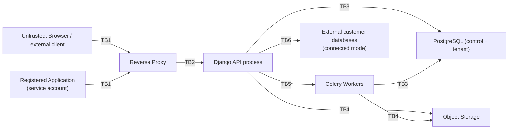

# Threat Model — Private Data Cloud

Status: Living document — implemented through Phase 12 (production
hardening); no longer a Phase 0 draft. Updated alongside the code as new
phases land, per CLAUDE.md's engineering process.
Last updated: 2026-08-19
Methodology: STRIDE per major trust boundary, plus explicit multi-tenancy
(IDOR/BOLA) analysis since that is the platform's central risk.

## 1. Assets

1. Uploaded files (potentially confidential organizational documents).
2. Tenant relational data (customer/business records, potentially PII).
3. Credentials: user passwords (hashed), session tokens, application
   credentials (hashed), external database connection secrets (encrypted).
4. Audit logs (integrity matters as much as confidentiality).
5. Platform availability (storage, database, queue).
6. Backups (a second copy of everything above).

## 2. Trust Boundaries

Each `TBn` is a boundary where input must be (re)validated and where an
authorization decision is made — trust established on one side is never
assumed to hold on the other.

## 3. STRIDE Analysis by Boundary

### TB1 — Client → Reverse Proxy / API

| Threat | Mitigation |
|---|---|
| Spoofing (stolen session/token) | Secure, HttpOnly, SameSite cookies for session auth; short-lived signed tokens for service accounts; TOTP MFA, **implemented Phase 10** — required before an already-authenticated actor can grant *another* user an administrative role while internet gateway mode is on (`permissions.services.assign_role`); credential rotation support |
| Tampering (modified request payloads, e.g. changing `organization_id`) | Server-side authorization on every mutating/read endpoint; never trust client-supplied tenant scoping without re-verifying against the actor's memberships |
| Repudiation | Audit log entries with actor + request ID for all sensitive actions |
| Information disclosure (verbose errors, stack traces) | Structured error responses; DEBUG=False in all non-dev environments; generic error bodies, detailed logs server-side only |
| Denial of service (login brute force, API flooding) | General API: DRF `anon`/`user` throttles (Phase 2). Auth endpoints specifically: a tighter dedicated `10/minute` scope on `/auth/login/`, `/auth/register/`, `/auth/mfa/verify/`, **implemented Phase 10**, verified by a test driving 11 real requests and confirming the 11th is rejected. No account lockout/backoff beyond rate limiting — a locked-out account is itself a DoS vector against that user, and rate limiting already bounds the attack rate. |
| Elevation of privilege (IDOR/BOLA: requesting another org's resource ID) | Central authorization service resolves every resource through the actor's organization membership; explicit automated tests per Section 25 of the master prompt |

### TB2 — Proxy → API process

| Threat | Mitigation |
|---|---|
| Tampering (request smuggling, header injection) | Proxy strips/normalizes hop-by-hop headers; API validates `Host`/forwarded headers against an allowlist |
| Information disclosure (internal service reachable if proxy misconfigured) | API only binds to the internal Docker network; no direct host port publish in production compose |

### TB3 — API/Workers → PostgreSQL

| Threat | Mitigation |
|---|---|
| Tampering (SQL injection via dynamic schema/table/column names or default values) | **Implemented, Phase 4.** Strict identifier regex validation (`databases/identifiers.py`) as a first pass, independent of and prior to `psycopg.sql.Identifier` safe quoting (`databases/ddl.py`) as a second — never raw string interpolation. Constant values (column defaults) are embedded via `psycopg.sql.Literal`, never concatenated. Verified with dedicated tests that attempt injection through every identifier and default-value input and confirm the target objects survive. |
| Elevation of privilege (tenant DB role escaping its schema) | **Mitigation available, opt-in, Phase 11 — not the default.** The design intent (schema-per-`TenantDatabase`, ADR-0005) assumes the application's tenant Postgres role is granted only `CONNECT`/`CREATE` on the database, not superuser. As deployed by default (`docker-compose.yml`), the app still connects as the container's bootstrap `POSTGRES_USER`, which *is* effectively a superuser within that Postgres instance — that has not changed, and isolation between tenant schemas by default is still enforced only by the application layer (identifier validation + membership-scoped catalog lookups). Phase 11 adds `system/tenant_role.py` + the `provision_tenant_role` management command, which creates a genuinely non-superuser role (`NOSUPERUSER NOCREATEDB NOCREATEROLE`, granted only `CONNECT`+`CREATE` on the tenant database — verified live: the new role can `CREATE SCHEMA` but a `CREATE DATABASE` attempt is rejected with `InsufficientPrivilege`) as a second, independent database-level privilege boundary. Not wired into `docker-compose.yml` or applied automatically — an operator runs the command once and explicitly switches `TENANT_DB_USER`/`TENANT_DB_PASSWORD` to adopt it, the same "add-on, not a default-breaking change" pattern as Phase 9's external-sharing toggle and Phase 10's internet gateway (see `docs/deployment/LOCAL_DEPLOYMENT.md`). |
| Information disclosure (connection string / credentials leakage) | **Implemented, Phase 8.** Secrets via environment/secret store, never logged; `ConnectedDatabase` credentials encrypted at rest with `CREDENTIAL_ENCRYPTION_KEY`, a key outside the row itself and distinct from `SECRET_KEY` (`databases/crypto.py`) |
| Denial of service (runaway query from CSV import or data explorer) | Server-side pagination caps (row API hard-capped at 500/page, Phase 6) and async processing for bulk operations (CSV import via Celery, Phase 5) were implemented in their respective phases. A server-side `statement_timeout` (`DB_STATEMENT_TIMEOUT_MS`, default 60s, both connections) was added Phase 11 as a backstop against any single pathological query, not a tuned per-endpoint budget — verified the full test suite still passes with it active, i.e. no legitimate operation exercised by the suite takes anywhere close to 60s. |

### TB4 — API/Workers → Object Storage

| Threat | Mitigation |
|---|---|
| Tampering (path traversal in object key) | Object keys are server-generated UUIDs, never derived from user-supplied filenames |
| Spoofing (forged presigned URL) | Presigned URLs are short-lived, scoped to one object + one operation, signed server-side |
| Information disclosure (public bucket misconfiguration) | Buckets default private; public/external sharing is an explicit, separately audited opt-in (Phase 9), disabled by default in local-only installs |
| Malware upload | **Implemented, Phase 12.** Real ClamAV integration (`storage/scanning.py`, via `clamd`) — fails closed into `status=quarantined` (hidden from listings, download blocked) if the file is flagged or the scanner is unreachable; never silently treated as clean. Off by default (`MALWARE_SCAN_ENABLED=False`) since it needs the optional `clamav` docker-compose service (`--profile malware-scan`) — verified live with a real EICAR-file upload through the API. |
| Unbounded upload size | **Implemented, Phase 12.** `MAX_UPLOAD_SIZE_BYTES` (default 2 GiB) enforced during the same streamed pass that computes the checksum — no upload size cap existed before this. |

### TB5 — API → Celery Workers (via Valkey)

| Threat | Mitigation |
|---|---|
| Tampering (task payload injection) | Valkey not exposed outside the internal network; tasks reference resource IDs and re-check authorization at execution time rather than trusting the enqueueing context blindly |
| Denial of service (queue flooding) | Per-organization rate limit on import-job creation, Phase 12 (`system/throttling.py::OrganizationRateThrottle`, keyed by organization rather than DRF's default per-user/IP scoping — verified live). Export job creation does not have an equivalent per-org limit yet; tracked as an open item, not assumed covered by the same fix. |

### TB6 — API → External Connected Databases

| Threat | Mitigation |
|---|---|
| Spoofing / MITM | **Implemented, Phase 8.** `sslmode` is configurable per `ConnectedDatabase` (`disable`/`prefer`/`require`/`verify-full`), defaulting to `require`; certificate validation is never silently disabled by the platform. |
| Tampering (credential exposure in logs/errors) | **Implemented, Phase 8.** `databases/connectors.py` catches every driver exception (`psycopg.Error`/`OperationalError`) and re-raises a fixed, sanitized `ConnectionFailed` message — the raw exception text, which can embed host/credential detail, never reaches a response, an audit event, or a log line. Verified by a test asserting a failed-connection response never contains the host or password. |
| Elevation of privilege (connected DB used to reach unintended tenant data) | **Implemented, Phase 8, application-layer only.** Connection tested before any credential is persisted (ADR-0009); recommending a least-privilege DB role on the customer's external database is documented but not (and cannot be) enforced by the platform — that privilege boundary lives entirely on the external system. |
| SSRF (the `host` field used to make the backend probe internal infrastructure) | **Implemented, Phase 12.** `databases/connectors.py::assert_host_is_safe` resolves the host and rejects link-local/reserved/multicast/unspecified addresses (covers cloud-metadata endpoints like `169.254.169.254`) before every connection attempt, not only at creation time — closing the DNS-rebinding window a create-time-only check would leave open. RFC1918 private ranges and loopback are allowed by default (this is a local-first, on-prem product; a customer's own PostgreSQL legitimately lives there), lockable via `CONNECTED_DATABASE_BLOCK_PRIVATE_NETWORKS` for a hosted/multi-tenant deployment where that assumption doesn't hold. |

## 4. Multi-Tenancy / IDOR-BOLA Deep Dive

This is the platform's highest-value target: a single authorization bug
here compromises every organization's data at once.

**Attack scenario:** An authenticated user of Organization A obtains or
guesses the UUID of a `FileObject`, `TenantDatabase`, `DBTable`, or row
belonging to Organization B, and requests it directly via
`/api/v1/.../<uuid>/`.

**Required defenses (all must hold, not any one):**

1. All resource-fetching code paths go through a shared
   `get_object_or_403_for_org(user, model, pk)`-style helper (or DRF
   permission class) that checks organization membership *before* returning
   any data — 404 vs 403 is a considered choice (prefer 404 for existence
   privacy on some resource types).
2. Database-level defense in depth for tenant relational data: each
   `TenantDatabase` lives in its own Postgres schema (`db_<uuid-hex>` —
   ADR-0005 originally sketched `org_<uuid>`/`org_<uuid>__db_<uuid>`,
   but that scheme exceeds Postgres's 63-byte identifier limit; see
   ADR-0005's implementation note and DATA_MODEL.md Section 3.5 for the
   actual naming, which still fully satisfies this defense — every
   schema maps to exactly one organization via
   `project.workspace.organization`, so cross-org isolation is
   unaffected by which level the schema boundary is drawn at), so even a
   missed application-layer filter cannot return cross-org rows through
   the same connection/role boundary as easily as a shared-table
   `WHERE org_id = ...` design would allow.
3. Automated tests (`tests/security/test_tenant_isolation.py` — this is
   the one file covering cross-organization IDOR/BOLA for every
   tenant-owned resource type; an earlier draft of this document
   referred to a separate `test_idor.py` that was never created, since
   its coverage was folded into the file above instead) that, for every
   resource type, assert:
   create as Org A → attempt read/update/delete as Org B → expect denial.
   These tests are treated as security regression tests and run in CI on
   every change to `permissions`, `storage`, `databases`, `sharing`.
4. Application credentials (service accounts) are subject to the exact same
   checks as human users — a scope like `database:read` is additionally
   bounded by `ResourceGrant`s, so a compromised application credential
   cannot read every organization's databases.

## 5. Non-Goals / Explicitly Out of Scope (for now)

- Protecting against a fully compromised host OS (out of scope — assume
  host hardening is an operational responsibility documented separately).
- Protecting against a malicious database administrator with direct
  Postgres superuser access (mitigated only by audit logging and access
  control on who holds that role, not by the application).
- Nation-state-level cryptographic attacks; standard, current, well-reviewed
  primitives (TLS 1.2+/1.3, Django's password hashers, AES-GCM for secret
  encryption) are considered sufficient.

## 6. Open Risks Tracked for Later Phases

- Malware scanning is a stub until Phase 9 (external sharing) — internal-only
  uploads carry residual risk if a compromised internal account uploads
  malicious files for other internal users to download. Mitigated partially
  by not auto-executing/previewing untrusted file types.
- Encryption-at-rest for object storage and tenant Postgres data disks is an
  infrastructure-level control (LUKS/ZFS native encryption) documented in
  LOCAL_DEPLOYMENT.md rather than re-implemented in the application; this is
  called out explicitly so it isn't silently skipped.
