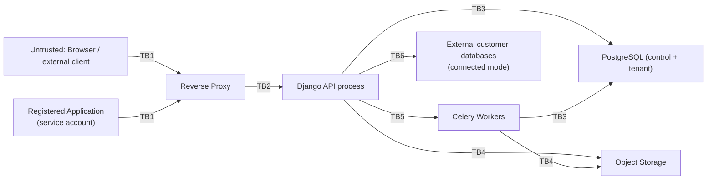

# Threat Model — IntraForge

Status: Living document — implemented through Phase 12 (production
hardening); no longer a Phase 0 draft. Updated alongside the code as new
phases land, per CLAUDE.md's engineering process.
Last updated: 2026-08-19
Methodology: STRIDE per major trust boundary, plus explicit multi-tenancy
(IDOR/BOLA) analysis since that is the platform's central risk.

## 1. Assets

1. Uploaded files (potentially confidential organizational documents).
2. Tenant relational data (customer/business records, potentially PII).
3. Credentials: user passwords (hashed), session tokens, application
   credentials (hashed), external database connection secrets (encrypted).
4. Audit logs (integrity matters as much as confidentiality).
5. Platform availability (storage, database, queue).
6. Backups (a second copy of everything above).

## 2. Trust Boundaries

Each `TBn` is a boundary where input must be (re)validated and where an
authorization decision is made — trust established on one side is never
assumed to hold on the other.

## 3. STRIDE Analysis by Boundary

### TB1 — Client → Reverse Proxy / API

| Threat | Mitigation |
|---|---|
| Spoofing (stolen session/token) | Secure, HttpOnly, SameSite cookies for session auth; short-lived signed tokens for service accounts; TOTP MFA, **implemented Phase 10** — required before an already-authenticated actor can grant *another* user an administrative role while internet gateway mode is on (`permissions.services.assign_role`); credential rotation support |
| Tampering (modified request payloads, e.g. changing `organization_id`) | Server-side authorization on every mutating/read endpoint; never trust client-supplied tenant scoping without re-verifying against the actor's memberships |
| Repudiation | Audit log entries with actor + request ID for all sensitive actions |
| Information disclosure (verbose errors, stack traces) | Structured error responses; DEBUG=False in all non-dev environments; generic error bodies, detailed logs server-side only |
| Denial of service (login brute force, API flooding) | General API: DRF `anon`/`user` throttles (Phase 2). Auth endpoints specifically: a tighter dedicated `10/minute` scope on `/auth/login/`, `/auth/register/`, `/auth/mfa/verify/`, **implemented Phase 10**, verified by a test driving 11 real requests and confirming the 11th is rejected. No account lockout/backoff beyond rate limiting — a locked-out account is itself a DoS vector against that user, and rate limiting already bounds the attack rate. |
| Elevation of privilege (IDOR/BOLA: requesting another org's resource ID) | Central authorization service resolves every resource through the actor's organization membership; explicit automated tests per Section 25 of the master prompt |

### TB2 — Proxy → API process

| Threat | Mitigation |
|---|---|
| Tampering (request smuggling, header injection) | Proxy strips/normalizes hop-by-hop headers; API validates `Host`/forwarded headers against an allowlist |
| Information disclosure (internal service reachable if proxy misconfigured) | API only binds to the internal Docker network; no direct host port publish in production compose |

### TB3 — API/Workers → PostgreSQL

| Threat | Mitigation |
|---|---|
| Tampering (SQL injection via dynamic schema/table/column names or default values) | **Implemented, Phase 4.** Strict identifier regex validation (`databases/identifiers.py`) as a first pass, independent of and prior to `psycopg.sql.Identifier` safe quoting (`databases/ddl.py`) as a second — never raw string interpolation. Constant values (column defaults) are embedded via `psycopg.sql.Literal`, never concatenated. Verified with dedicated tests that attempt injection through every identifier and default-value input and confirm the target objects survive. |
| Elevation of privilege (tenant DB role escaping its schema) | **Mitigation available, opt-in, Phase 11 — not the default.** The design intent (schema-per-`TenantDatabase`, ADR-0005) assumes the application's tenant Postgres role is granted only `CONNECT`/`CREATE` on the database, not superuser. As deployed by default (`docker-compose.yml`), the app still connects as the container's bootstrap `POSTGRES_USER`, which *is* effectively a superuser within that Postgres instance — that has not changed, and isolation between tenant schemas by default is still enforced only by the application layer (identifier validation + membership-scoped catalog lookups). Phase 11 adds `system/tenant_role.py` + the `provision_tenant_role` management command, which creates a genuinely non-superuser role (`NOSUPERUSER NOCREATEDB NOCREATEROLE`, granted only `CONNECT`+`CREATE` on the tenant database — verified live: the new role can `CREATE SCHEMA` but a `CREATE DATABASE` attempt is rejected with `InsufficientPrivilege`) as a second, independent database-level privilege boundary. Not wired into `docker-compose.yml` or applied automatically — an operator runs the command once and explicitly switches `TENANT_DB_USER`/`TENANT_DB_PASSWORD` to adopt it, the same "add-on, not a default-breaking change" pattern as Phase 9's external-sharing toggle and Phase 10's internet gateway (see `docs/deployment/LOCAL_DEPLOYMENT.md`). |
| Information disclosure (connection string / credentials leakage) | **Implemented, Phase 8.** Secrets via environment/secret store, never logged; `ConnectedDatabase` credentials encrypted at rest with `CREDENTIAL_ENCRYPTION_KEY`, a key outside the row itself and distinct from `SECRET_KEY` (`databases/crypto.py`) |
| Denial of service (runaway query from CSV import or data explorer) | Server-side pagination caps (row API hard-capped at 500/page, Phase 6) and async processing for bulk operations (CSV import via Celery, Phase 5) were implemented in their respective phases. A server-side `statement_timeout` (`DB_STATEMENT_TIMEOUT_MS`, default 60s, both connections) was added Phase 11 as a backstop against any single pathological query, not a tuned per-endpoint budget — verified the full test suite still passes with it active, i.e. no legitimate operation exercised by the suite takes anywhere close to 60s. |

### TB4 — API/Workers → Object Storage

| Threat | Mitigation |
|---|---|
| Tampering (path traversal in object key) | Object keys are server-generated UUIDs, never derived from user-supplied filenames |
| Spoofing (forged presigned URL) | Presigned URLs are short-lived, scoped to one object + one operation, signed server-side |
| Information disclosure (public bucket misconfiguration) | Buckets default private; public/external sharing is an explicit, separately audited opt-in (Phase 9), disabled by default in local-only installs |
| Malware upload | **Implemented, Phase 12.** Real ClamAV integration (`storage/scanning.py`, via `clamd`) — fails closed into `status=quarantined` (hidden from listings, download blocked) if the file is flagged or the scanner is unreachable; never silently treated as clean. Off by default (`MALWARE_SCAN_ENABLED=False`) since it needs the optional `clamav` docker-compose service (`--profile malware-scan`) — verified live with a real EICAR-file upload through the API. |
| Unbounded upload size | **Implemented, Phase 12.** `MAX_UPLOAD_SIZE_BYTES` (default 2 GiB) enforced during the same streamed pass that computes the checksum — no upload size cap existed before this. |

### TB5 — API → Celery Workers (via Valkey)

| Threat | Mitigation |
|---|---|
| Tampering (task payload injection) | Valkey not exposed outside the internal network; tasks reference resource IDs and re-check authorization at execution time rather than trusting the enqueueing context blindly |
| Denial of service (queue flooding) | Per-organization rate limit on import-job creation, Phase 12 (`system/throttling.py::OrganizationRateThrottle`, keyed by organization rather than DRF's default per-user/IP scoping — verified live). Export job creation does not have an equivalent per-org limit yet; tracked as an open item, not assumed covered by the same fix. |

### TB6 — API → External Connected Databases

| Threat | Mitigation |
|---|---|
| Spoofing / MITM | **Implemented, Phase 8.** `sslmode` is configurable per `ConnectedDatabase` (`disable`/`prefer`/`require`/`verify-full`), defaulting to `require`; certificate validation is never silently disabled by the platform. |
| Tampering (credential exposure in logs/errors) | **Implemented, Phase 8.** `databases/connectors.py` catches every driver exception (`psycopg.Error`/`OperationalError`) and re-raises a fixed, sanitized `ConnectionFailed` message — the raw exception text, which can embed host/credential detail, never reaches a response, an audit event, or a log line. Verified by a test asserting a failed-connection response never contains the host or password. |
| Elevation of privilege (connected DB used to reach unintended tenant data) | **Implemented, Phase 8, application-layer only.** Connection tested before any credential is persisted (ADR-0009); recommending a least-privilege DB role on the customer's external database is documented but not (and cannot be) enforced by the platform — that privilege boundary lives entirely on the external system. |
| SSRF (the `host` field used to make the backend probe internal infrastructure) | **Implemented, Phase 12.** `databases/connectors.py::assert_host_is_safe` resolves the host and rejects link-local/reserved/multicast/unspecified addresses (covers cloud-metadata endpoints like `169.254.169.254`) before every connection attempt, not only at creation time — closing the DNS-rebinding window a create-time-only check would leave open. RFC1918 private ranges and loopback are allowed by default (this is a local-first, on-prem product; a customer's own PostgreSQL legitimately lives there), lockable via `CONNECTED_DATABASE_BLOCK_PRIVATE_NETWORKS` for a hosted/multi-tenant deployment where that assumption doesn't hold. |

## 4. Multi-Tenancy / IDOR-BOLA Deep Dive

This is the platform's highest-value target: a single authorization bug
here compromises every organization's data at once.

**Attack scenario:** An authenticated user of Organization A obtains or
guesses the UUID of a `FileObject`, `TenantDatabase`, `DBTable`, or row
belonging to Organization B, and requests it directly via
`/api/v1/.../<uuid>/`.

**Required defenses (all must hold, not any one):**

1. All resource-fetching code paths go through a shared
   `get_object_or_403_for_org(user, model, pk)`-style helper (or DRF
   permission class) that checks organization membership *before* returning
   any data — 404 vs 403 is a considered choice (prefer 404 for existence
   privacy on some resource types).
2. Database-level defense in depth for tenant relational data: each
   `TenantDatabase` lives in its own Postgres schema (`db_<uuid-hex>` —
   ADR-0005 originally sketched `org_<uuid>`/`org_<uuid>__db_<uuid>`,
   but that scheme exceeds Postgres's 63-byte identifier limit; see
   ADR-0005's implementation note and DATA_MODEL.md Section 3.5 for the
   actual naming, which still fully satisfies this defense — every
   schema maps to exactly one organization via
   `project.workspace.organization`, so cross-org isolation is
   unaffected by which level the schema boundary is drawn at), so even a
   missed application-layer filter cannot return cross-org rows through
   the same connection/role boundary as easily as a shared-table
   `WHERE org_id = ...` design would allow.
3. Automated tests (`tests/security/test_tenant_isolation.py` — this is
   the one file covering cross-organization IDOR/BOLA for every
   tenant-owned resource type; an earlier draft of this document
   referred to a separate `test_idor.py` that was never created, since
   its coverage was folded into the file above instead) that, for every
   resource type, assert:
   create as Org A → attempt read/update/delete as Org B → expect denial.
   These tests are treated as security regression tests and run in CI on
   every change to `permissions`, `storage`, `databases`, `sharing`.
4. Application credentials (service accounts) are subject to the exact same
   checks as human users — a scope like `database:read` is additionally
   bounded by `ResourceGrant`s, so a compromised application credential
   cannot read every organization's databases.

## 4a. Within-Organization Capability Enforcement

A distinct threat from Section 4's cross-*organization* IDOR/BOLA: a
legitimate, active member of the *correct* organization reaching data
or actions gated by a resource-specific capability (`database.read`,
`storage.read`, `connection.manage`, ...) that was never granted to
them — no role, no `ResourceGrant`, no `ShareGrant`. The failure mode
is a view fetching its object via a "does this org contain this
resource, and is the actor an active member" helper
(`get_member_tenant_database`, `get_member_bucket`, etc. — correct and
necessary for Section 4's cross-org defense) and stopping there,
never additionally checking `has_permission` for the operation itself.

**Status legend:** `designed` — the capability exists in
`permissions/catalog.py` and PERMISSIONS.md's catalog; `implemented` —
a view actually calls `has_permission`/a service-layer `_require`
equivalent before returning data or mutating; `tested` — a regression
test asserts a member without the capability is denied; `live-verified`
— confirmed against the actual running Docker stack with a second real
user account, not only the automated suite.

A live QA pass (registering a second real, unprivileged organization
member and attempting to reach another member's resources through the
running app, then auditing every other view module for the same
fetch-by-membership-only pattern) found seven endpoints across five
apps where enforcement had silently regressed to organization
membership alone. All seven are now designed, implemented, tested, and
live-verified:

| Endpoint(s) | Exposed | Capability now enforced |
|---|---|---|
| `TenantDatabaseDetailView`/`TableListCreateView`/`TableDetailView` (`databases`) | Full schema: table/column names and types | `database.read` |
| `DashboardListCreateView`/`DashboardDetailView` (`analytics`) | A dashboard's definition — which tables/columns/operations each widget queries | `database.read` |
| `FolderListCreateView.get` (`storage`) | A bucket's folder names | `storage.read` |
| `EnvironmentListCreateView.get` (`environments`) | Every Environment's name, type, `is_production_tier`, binding status | `environment.read` |
| `ExportJobListCreateView.get`/`ExportJobDetailView.get` (`exports`) | Export-job status, checksum, size, error message | `export.manage` |
| `ConnectedDatabaseListCreateView.get`/`ConnectedDatabaseDetailView.get` (`databases`) | Host, port, database name, username of an external database connection (never the password — confirmed unaffected by an existing test) | `connection.manage` |
| `WorkspaceListCreateView.post`/`ProjectListCreateView.post` (`workspaces`) | Not a read at all — creating new organizational structure required *no permission of any kind* | New `workspace.manage` permission (a product-behavior change: a plain invited member can no longer create a workspace/project — documented, not silent) |

In every case, the *data-mutating or data-returning* sibling operation
one layer deeper (row reads, dashboard render, schema introspection,
connection test/create/delete) already enforced the correct capability
correctly — these were specifically the metadata/definition-reading (or,
for workspaces, the creation) endpoints that had never been wired up,
not a systemic failure of the permission model itself. Full evidence
and reasoning for each: the two commits titled `fix(security):` in
this repository's history for 2026-08-30, and `CLAUDE.md`'s narrative
of the same session.

**Operational note:** granting `workspace.manage` to additional default
roles (`database-administrator`, `storage-administrator`, `developer`)
only takes effect on an already-running deployment after an operator
re-runs `manage.py seed_permissions` — the same step already documented
as part of every upgrade in `LOCAL_DEPLOYMENT.md` Section 4, not a new
requirement, but easy to forget and worth calling out in the upgrade
guide explicitly.

**A second live QA pass (2026-09-07, under the Internal Pilot v0.9
mandate's "security/reliability" priority — see
`docs/implementation/RELEASE_READINESS.md`) repeated the same
methodology — a second real, unprivileged member attempting to reach
another member's resources through the running app, then a systematic
re-audit of every remaining `get_member_*`-style view across
`applications`, `imports`, `storage`, and `databases` for the same
fetch-by-membership-only anti-pattern — and found four more, all now
designed, implemented, tested, and live-verified:**

| Endpoint(s) | Exposed | Capability now enforced |
|---|---|---|
| `ApplicationListCreateView.get`/`ApplicationDetailView.get` (`applications`) | Every registered Application's name/description/owner — no permission gated this at all, since `application.read` didn't exist before this fix | New `application.read` |
| `ImportJobListCreateView.get`/`ImportJobDetailView.get`/`ImportJobErrorListView.get` (`imports`) | Import job status, and — via `ImportJobErrorSerializer.raw_row` — the literal content of rejected CSV rows (real tenant data, not just metadata) | `database.read` |
| `BucketListCreateView.get` (`storage`) | Every bucket in a project (name, `versioning_enabled`, `created_by`) | `storage.read`, filtered per-bucket (see below) |
| `TenantDatabaseListCreateView.get` (`databases`) | Every TenantDatabase in a project (name, `created_by`) | `database.read`, filtered per-bucket/-database (see below) |

The bucket and tenant-database list endpoints are fixed differently from
the rest of this table's entries: `storage.read`/`database.read` are
resource-scoped (a `ResourceGrant` on one specific bucket/database, not
just a role-wide grant — see Section 4's `RESOURCE_TYPE_BUCKET`/
`RESOURCE_TYPE_TENANT_DATABASE`), and these two endpoints list *across*
many such resources at once. A single all-or-nothing permission check
(the pattern used everywhere else in this table) would have been a
*stricter*, inconsistent gate than the detail endpoints for the same
resource already enforce — hiding a bucket/database a caller can reach
directly via a per-resource grant. Fixed by filtering the queryset
per-item instead (role-wide OR a matching `ResourceGrant`), confirmed by
a dedicated test proving a member with only a single-bucket/-database
grant sees exactly that one item, not zero and not all of them.

The `imports` finding is the most severe of the four: `raw_row` is
literal rejected data from the uploaded file, not metadata about it —
closer in kind to Section 4's row-data IDOR concern than to the
schema/definition-only exposures the rest of this section covers.

**A fifth, distinct finding in the same pass — not a missing capability
check, but a missing invariant entirely**: the Phase 22 Environment-
isolation guarantee ("an ApplicationCredential scoped to one Environment
can never reach a resource bound to a different one") was enforced in
`databases`'/`storage`'s row/file views (`check_environment_scope`,
`environments/services.py`) but was never wired into `imports` at all —
none of `ImportPreviewView`, `ImportJobListCreateView.get/post`,
`ImportJobDetailView.get`, or `ImportJobErrorListView.get` called it.
Concretely: a Development-scoped credential holding a real
`database.write`/`storage.read` `ResourceGrant` on a *Production*-bound
TenantDatabase/Bucket (a real, if unusual, misconfiguration — not a
hypothetical) could import a CSV from a Production bucket into a
Production table through `POST /tables/<id>/import/` even though the
identical operation through `databases`'/`storage`'s own endpoints would
correctly be denied. Live-verified end to end (real Environment-scoped
credentials, real bound TenantDatabase/Bucket, real ResourceGrants on
both sides of the isolation boundary — mirroring
`environments/tests/test_environments.py`'s own
`EnvironmentCredentialAndIsolationTests` setup) in
`imports/tests/test_imports.py`'s `ImportEnvironmentScopeTests`: preview,
list, and — the write path specifically — import-creation are all now
denied across the boundary, confirmed with `ImportJob.objects.count()`
proving no job was created, not just that the HTTP response was a 403.

## 4b. Shared-Infrastructure Enforcement Under a Multi-Process Deployment

A distinct class from 4a/4: mechanisms that were correctly *designed* and
*configured* (a throttle rate, a checkpoint-and-resume import pipeline)
but never actually worked as intended once run against this project's
real multi-process deployment shape (`gunicorn --workers 3`, a separate
Celery `worker` process/container) rather than a single Python process —
found live, not by re-reading the configuration that looked correct on
paper. Both closed 2026-09-07 in the same pass as 4a's four new findings
above.

**Rate limiting was configured but not actually enforced consistently.**
`DEFAULT_THROTTLE_RATES`'s `"auth"` scope (10/minute, specifically to
resist credential-stuffing/brute-force against login/register/MFA-verify
— see the comment already in `config/settings/base.py`) and
`system.throttling.OrganizationRateThrottle`'s `"import"` scope both rely
on DRF's throttle classes, which key their request counters through
Django's cache framework. No `CACHES` setting existed anywhere in this
codebase, so Django silently defaulted to `LocMemCache` — **per-process**
memory. With gunicorn's 3 worker processes each holding an independent,
unshared counter, the throttle's real, live-verified behavior was **not**
"blocked after 10 requests" but an inconsistent, load-dependent pattern
close to 3× looser than configured — confirmed directly: 20 rapid login
attempts against the real running proxy produced a pattern of
`401 401 401 401 429 429 429 401 401 401 429 429 429 401 429 429 429 401 429 429`
(each gunicorn worker independently allowing ~3-4 before its own
in-memory count caught up), not a clean cutoff at request 11. Fixed by
adding a real `CACHES` setting (`config/settings/base.py`) — Django 5's
native `django.core.cache.backends.redis.RedisCache` against the same
Valkey instance already running for Celery, on a separate DB index (`/1`,
not Celery's `/0`) so the two don't share a key namespace. No new
datastore, per CLAUDE.md rule 6. Re-verified live after the fix: the
identical 20-request test now produces a clean
`401×10, 429×10` — enforced consistently regardless of which of the 3
workers handles any given request.

**A worker process crashing mid-task silently lost the task, with no
error, no recovery, and no way for an operator to know it would never
complete.** `imports/tasks.py::run_import_task` already has a
checkpoint-and-resume design (`ImportJob.last_processed_row`, proven safe
across an in-process retry by
`test_connection_failure_is_reraised_and_progress_checkpointed_for_retry`)
and a `self.retry()`/`MaxRetriesExceededError` handler — but both only
ever fire for an exception raised *within* the running Python process.
Celery's default (`acks_late=False`) acknowledges a task to the broker
the moment a worker picks it up, before it runs, so a worker that dies
mid-task (OOM-kill, a container restart, a deploy) never raises anything
for that handler to catch — the message is already gone from the
broker's perspective, and the job is left at `status=running` forever.
**Live-verified the actual failure, not assumed**: started a real
60,000-row import against the real `worker` container (not eager/test
mode), let it reach `imported_rows=4000`, `docker compose kill -s
SIGKILL worker`, restarted the container, and confirmed the job sat at
`running`/unchanged with no `dataset.import.finish` audit event and no
error for as long as observed. Fixed with `acks_late=True` +
`reject_on_worker_lost=True` on `run_import_task` specifically (not a
Celery-wide default — `exports/tasks.py::run_restore_task` has its own,
narrower, already-documented one-retry-only safety margin that a blanket
change would have silently overridden). That alone was insufficient,
also live-verified: the Redis/Valkey broker transport's default
`visibility_timeout` (how long an unacknowledged message is held before
being considered abandoned and redelivered) is 3600 seconds — with
`acks_late` alone, a killed job's task wasn't redelivered within a
realistic observation window either. Added an explicit
`CELERY_BROKER_TRANSPORT_OPTIONS = {"visibility_timeout": 2400}` (40
minutes — comfortably above `CELERY_TASK_TIME_LIMIT`'s 30-minute hard cap
per task, so a task still legitimately within its own allowed runtime is
never prematurely redelivered to a second worker while the first is
still genuinely working on it, which would risk concurrent duplicate
execution). Live-verified the complete, corrected mechanism at a
temporarily shortened timeout (20s, via a `CELERY_VISIBILITY_TIMEOUT_SECONDS`
env override, reverted afterward): a killed job's task was redelivered
to the restarted worker and resumed from its checkpoint, observed
advancing from `imported_rows=6000` (at the kill) to `47000` before the
test's own cleanup script raced it — real further progress past the
crash point, not merely "no longer stuck," and consistent with a clean
resume rather than a restart-from-zero (which `run_import`'s existing
checkpoint logic already guarantees doesn't duplicate rows, per the
retry test cited above).

**Not extended to `exports`/`system` Celery tasks in this pass,
deliberately.** `run_export_task` and `system.tasks`'s backup/
restore-test tasks weren't audited for the same acks_late gap — the
throttle-cache fix (`CACHES`) benefits every throttled endpoint
uniformly, but the acks_late fix was scoped narrowly to the one task
proven broken and already designed for safe resumption.
`run_restore_task` in particular has its own, different, already-
documented retry-safety reasoning (see the comment in
`exports/tasks.py`) that a mechanical copy of this fix should not
override without the same live-verification discipline applied here —
tracked as an open item, not silently assumed safe.

## 4c. exports/system Celery crash-recovery audit (2026-09-08)

Closed the item Section 4b left open, by actually auditing rather than
mechanically copying. Two tasks, two different outcomes:

**`run_export_task` — same gap as `run_import_task`, same fix, same
live-verification standard.** No `acks_late` meant a worker killed
mid-export left the `ExportJob` stuck at `RUNNING` forever. Confirmed
safe to fix identically: `run_export` rebuilds the `.icp` from the
organization's *current* data and writes it to a deterministic
`object_key`, so a redelivered retry-from-scratch overwrites the same
key rather than duplicating anything. Added `acks_late=True,
reject_on_worker_lost=True`. **Live-verified against the real worker
container**: a real Organization with a ~900MB random (incompressible —
so the DEFLATE step actually takes measurable time) file in a bucket,
`run_export_task` dispatched, `docker kill -s SIGKILL` on the worker
while the job was confirmed `status=running`, worker restarted, and — at
a temporarily shortened `CELERY_VISIBILITY_TIMEOUT_SECONDS=20` (reverted
immediately after) — the job went from stuck at `running` to redelivered
and `COMPLETED` with a real 944,007,374-byte `.icp` and checksum.

**`run_restore_task` — audited and deliberately left unfixed: a real
correctness hazard, not just inherited caution.** `restorer.restore_package`
is wrapped in `transaction.atomic` on both connections, so a worker
killed *during* that block is actually the safe case — Postgres rolls
back the uncommitted transaction on its own, and a redelivered
retry-from-scratch is clean. The real gap is narrower: `run_restore`'s
`finally` block unconditionally deletes the staged `.icp` from object
storage, and the job isn't saved as `COMPLETED` until *after* that
`finally` runs. A worker killed in the gap between "the restore's
transaction committed" and "the job row was saved as `COMPLETED`" would,
under a naive `acks_late` redelivery, either find the staged file
already gone (raises cleanly, but wrongly marks an *actually-successful*
restore as `FAILED`) or — if that delete/save ordering were flipped to
close the gap — find it still present and silently create a **second**
brand-new Organization for the same package, since `restore_package` has
no way to detect "this package was already restored" and always creates
a fresh one. Neither reordering makes redelivery safe; a real fix needs
a durable idempotency marker (e.g. persisting the new `organization_id`
inside the same atomic block that creates it, so a resumed run can
detect "already restored" before calling `restore_package` again) plus
its own live SIGKILL experiment once that exists. Not shipped as a
guess — this is a silent-data-duplication risk, not merely a stuck job,
which is a strictly worse failure mode to introduce. `exports/tasks.py`
now documents this full reasoning inline in place of the older, vaguer
note; one-retry-only (for genuine in-process exceptions) is unchanged.

**`system/tasks.py`** — both scheduled tasks are simple and idempotent;
reading them found no equivalent in-flight-mutation risk, so no fix was
needed there.

Full session narrative, test/lint re-verification, and the disposable
test organizations left behind: `docs/implementation/RELEASE_READINESS.md`'s
"Completed 2026-09-08" entry.

## 5. Non-Goals / Explicitly Out of Scope (for now)

- Protecting against a fully compromised host OS (out of scope — assume
  host hardening is an operational responsibility documented separately).
- Protecting against a malicious database administrator with direct
  Postgres superuser access (mitigated only by audit logging and access
  control on who holds that role, not by the application).
- Nation-state-level cryptographic attacks; standard, current, well-reviewed
  primitives (TLS 1.2+/1.3, Django's password hashers, AES-GCM for secret
  encryption) are considered sufficient.

## 6. Open Risks Tracked for Later Phases

- Malware scanning is a stub until Phase 9 (external sharing) — internal-only
  uploads carry residual risk if a compromised internal account uploads
  malicious files for other internal users to download. Mitigated partially
  by not auto-executing/previewing untrusted file types.
- Encryption-at-rest for object storage and tenant Postgres data disks is an
  infrastructure-level control (LUKS/ZFS native encryption) documented in
  LOCAL_DEPLOYMENT.md rather than re-implemented in the application; this is
  called out explicitly so it isn't silently skipped.
- **`Environment.config.auth.allowed_origins` (Phase 22) is stored and
  editable via the Developer portal's Auth tab but has no server-side
  enforcement point.** Deliberately not implemented as a guess: it's
  unclear whether the intended semantics are (a) per-Environment dynamic
  `Access-Control-Allow-Origin` for browser-originated requests bearing
  that Environment's credential, which `django-cors-headers`' global
  single-allowlist model doesn't support out of the box and would need
  request-time Origin validation against the resolved Environment before
  any custom CORS header is echoed back — a real risk of introducing a
  CORS bypass if the matching logic is wrong — or (b) a non-CORS
  Referer/Origin allowlist check purely for bearer-token requests
  (`ApplicationCredential` auth is typically server-to-server and not
  subject to browser CORS at all, so this would be an
  application-level control, not a browser one, with a different threat
  model). Resolve which semantics are intended — an ADR, not a quick
  patch — before implementing either; app-wide `CORS_ALLOWED_ORIGINS`
  (`config/settings/base.py`, `corsheaders`) remains the real, enforced
  control in the meantime.
