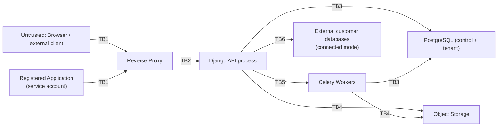

# Threat Model — Private Data Cloud

Status: DRAFT (Phase 0)
Last updated: 2026-08-07
Methodology: STRIDE per major trust boundary, plus explicit multi-tenancy
(IDOR/BOLA) analysis since that is the platform's central risk.

## 1. Assets

1. Uploaded files (potentially confidential organizational documents).
2. Tenant relational data (customer/business records, potentially PII).
3. Credentials: user passwords (hashed), session tokens, application
   credentials (hashed), external database connection secrets (encrypted).
4. Audit logs (integrity matters as much as confidentiality).
5. Platform availability (storage, database, queue).
6. Backups (a second copy of everything above).

## 2. Trust Boundaries

Each `TBn` is a boundary where input must be (re)validated and where an
authorization decision is made — trust established on one side is never
assumed to hold on the other.

## 3. STRIDE Analysis by Boundary

### TB1 — Client → Reverse Proxy / API

| Threat | Mitigation |
|---|---|
| Spoofing (stolen session/token) | Secure, HttpOnly, SameSite cookies for session auth; short-lived signed tokens for service accounts; MFA for admin roles (Phase 11); credential rotation support |
| Tampering (modified request payloads, e.g. changing `organization_id`) | Server-side authorization on every mutating/read endpoint; never trust client-supplied tenant scoping without re-verifying against the actor's memberships |
| Repudiation | Audit log entries with actor + request ID for all sensitive actions |
| Information disclosure (verbose errors, stack traces) | Structured error responses; DEBUG=False in all non-dev environments; generic error bodies, detailed logs server-side only |
| Denial of service (login brute force, API flooding) | Rate limiting on auth endpoints and public API (Phase 2/10), account lockout/backoff on repeated auth failures |
| Elevation of privilege (IDOR/BOLA: requesting another org's resource ID) | Central authorization service resolves every resource through the actor's organization membership; explicit automated tests per Section 25 of the master prompt |

### TB2 — Proxy → API process

| Threat | Mitigation |
|---|---|
| Tampering (request smuggling, header injection) | Proxy strips/normalizes hop-by-hop headers; API validates `Host`/forwarded headers against an allowlist |
| Information disclosure (internal service reachable if proxy misconfigured) | API only binds to the internal Docker network; no direct host port publish in production compose |

### TB3 — API/Workers → PostgreSQL

| Threat | Mitigation |
|---|---|
| Tampering (SQL injection via dynamic schema/table names) | Strict identifier allowlist/regex validation, parameterized queries for all data, `psycopg.sql.Identifier`-style safe quoting for any dynamic identifier, never raw string interpolation |
| Elevation of privilege (tenant DB role escaping its schema) | Tenant Postgres role for the application is granted only `USAGE`/`CREATE` on its own `org_<uuid>` schemas, not superuser; per-org schema boundary enforced at the DB grant level in addition to the app layer |
| Information disclosure (connection string / credentials leakage) | Secrets via environment/secret store, never logged; `ConnectedDatabase` credentials encrypted at rest with a key outside the DB itself |
| Denial of service (runaway query from CSV import or data explorer) | Query timeouts, statement timeouts, server-side pagination caps, async processing for bulk operations |

### TB4 — API/Workers → Object Storage

| Threat | Mitigation |
|---|---|
| Tampering (path traversal in object key) | Object keys are server-generated UUIDs, never derived from user-supplied filenames |
| Spoofing (forged presigned URL) | Presigned URLs are short-lived, scoped to one object + one operation, signed server-side |
| Information disclosure (public bucket misconfiguration) | Buckets default private; public/external sharing is an explicit, separately audited opt-in (Phase 9), disabled by default in local-only installs |
| Malware upload | Antivirus/malware scan hook point in the upload pipeline (stub in early phases, wired to ClamAV or similar before external sharing is enabled) |

### TB5 — API → Celery Workers (via Valkey)

| Threat | Mitigation |
|---|---|
| Tampering (task payload injection) | Valkey not exposed outside the internal network; tasks reference resource IDs and re-check authorization at execution time rather than trusting the enqueueing context blindly |
| Denial of service (queue flooding) | Per-org job rate limits/quotas on import/export job creation |

### TB6 — API → External Connected Databases

| Threat | Mitigation |
|---|---|
| Spoofing / MITM | TLS required for external DB connections where the target supports it; certificate validation not disabled |
| Tampering (credential exposure in logs/errors) | Connection strings never logged; errors from external DB drivers sanitized before returning to the client |
| Elevation of privilege (connected DB used to reach unintended tenant data) | Connection tested and scoped at configuration time; recommend least-privilege DB role on the customer's external database; documented in LOCAL_DEPLOYMENT/connector docs |

## 4. Multi-Tenancy / IDOR-BOLA Deep Dive

This is the platform's highest-value target: a single authorization bug
here compromises every organization's data at once.

**Attack scenario:** An authenticated user of Organization A obtains or
guesses the UUID of a `FileObject`, `TenantDatabase`, `DBTable`, or row
belonging to Organization B, and requests it directly via
`/api/v1/.../<uuid>/`.

**Required defenses (all must hold, not any one):**

1. All resource-fetching code paths go through a shared
   `get_object_or_403_for_org(user, model, pk)`-style helper (or DRF
   permission class) that checks organization membership *before* returning
   any data — 404 vs 403 is a considered choice (prefer 404 for existence
   privacy on some resource types).
2. Database-level defense in depth for tenant relational data: each
   organization's tenant tables live in their own Postgres schema
   (`org_<uuid>`), so even a missed application-layer filter cannot return
   cross-org rows through the same connection/role boundary as easily as a
   shared-table `WHERE org_id = ...` design would allow.
3. Automated tests (`tests/security/test_tenant_isolation.py`,
   `tests/security/test_idor.py`) that, for every resource type, assert:
   create as Org A → attempt read/update/delete as Org B → expect denial.
   These tests are treated as security regression tests and run in CI on
   every change to `permissions`, `storage`, `databases`, `sharing`.
4. Application credentials (service accounts) are subject to the exact same
   checks as human users — a scope like `database:read` is additionally
   bounded by `ResourceGrant`s, so a compromised application credential
   cannot read every organization's databases.

## 5. Non-Goals / Explicitly Out of Scope (for now)

- Protecting against a fully compromised host OS (out of scope — assume
  host hardening is an operational responsibility documented separately).
- Protecting against a malicious database administrator with direct
  Postgres superuser access (mitigated only by audit logging and access
  control on who holds that role, not by the application).
- Nation-state-level cryptographic attacks; standard, current, well-reviewed
  primitives (TLS 1.2+/1.3, Django's password hashers, AES-GCM for secret
  encryption) are considered sufficient.

## 6. Open Risks Tracked for Later Phases

- Malware scanning is a stub until Phase 9 (external sharing) — internal-only
  uploads carry residual risk if a compromised internal account uploads
  malicious files for other internal users to download. Mitigated partially
  by not auto-executing/previewing untrusted file types.
- Encryption-at-rest for object storage and tenant Postgres data disks is an
  infrastructure-level control (LUKS/ZFS native encryption) documented in
  LOCAL_DEPLOYMENT.md rather than re-implemented in the application; this is
  called out explicitly so it isn't silently skipped.
